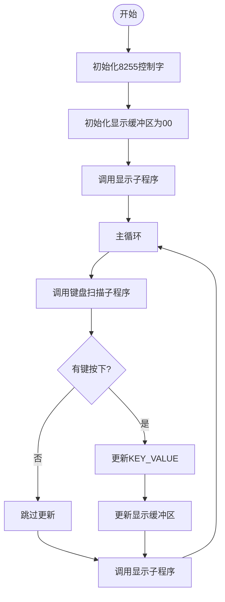
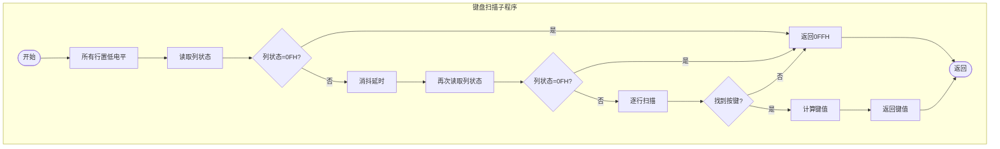
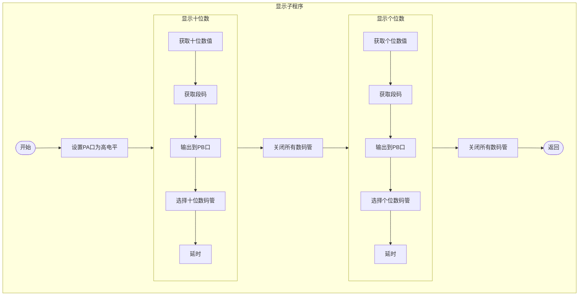

```mermaid
flowchart TD
    Start([开始]) --> Init[初始化8255控制字]
    Init --> InitDisplay[初始化显示缓冲区为00]
    InitDisplay --> Display[调用显示子程序]
    Display --> MainLoop[主循环]
    
    MainLoop --> KeyScan[调用键盘扫描子程序]
    KeyScan --> CheckKey{有键按下?}
    
    CheckKey -->|是| UpdateKey[更新KEY_VALUE]
    CheckKey -->|否| NoUpdate[跳过更新]
    
    UpdateKey --> UpdateBuffer[更新显示缓冲区]
    NoUpdate --> DisplayCall[调用显示子程序]
    UpdateBuffer --> DisplayCall
    
    DisplayCall --> MainLoop
```

```mermaid
flowchart TD
    
    subgraph KeyScanSub [键盘扫描子程序]
        KS_Start([开始]) --> KS_InitRows[所有行置低电平]
        KS_InitRows --> KS_ReadCols[读取列状态]
        KS_ReadCols --> KS_CheckCols{列状态=0FH?}
        KS_CheckCols -->|是| KS_NoKey[返回0FFH]
        KS_CheckCols -->|否| KS_Debounce[消抖延时]
        KS_Debounce --> KS_ReadAgain[再次读取列状态]
        KS_ReadAgain --> KS_CheckAgain{列状态=0FH?}
        KS_CheckAgain -->|是| KS_NoKey
        KS_CheckAgain -->|否| KS_ScanRows[逐行扫描]
        KS_ScanRows --> KS_FoundKey{找到按键?}
        KS_FoundKey -->|是| KS_CalcValue[计算键值]
        KS_FoundKey -->|否| KS_NoKey
        KS_CalcValue --> KS_ReturnKey[返回键值]
        KS_NoKey --> KS_End([返回])
        KS_ReturnKey --> KS_End
    end
```

```mermaid
flowchart TD
    
    subgraph DisplaySub [显示子程序]
        D_Start([开始]) --> D_SetPAHigh[设置PA口为高电平]
        D_SetPAHigh --> D_ShowTen[显示十位数]
        D_ShowTen --> D_DisableAll[关闭所有数码管]
        D_DisableAll --> D_ShowUnit[显示个位数]
        D_ShowUnit --> D_DisableAll2[关闭所有数码管]
        D_DisableAll2 --> D_End([返回])
        
        subgraph D_ShowTen [显示十位数]
            DT_GetValue[获取十位数值] --> DT_GetCode[获取段码]
            DT_GetCode --> DT_Output[输出到PB口]
            DT_Output --> DT_Select[选择十位数码管]
            DT_Select --> DT_Delay[延时]
        end
        
        subgraph D_ShowUnit [显示个位数]
            DU_GetValue[获取个位数值] --> DU_GetCode[获取段码]
            DU_GetCode --> DU_Output[输出到PB口]
            DU_Output --> DU_Select[选择个位数码管]
            DU_Select --> DU_Delay[延时]
        end
    end
```

